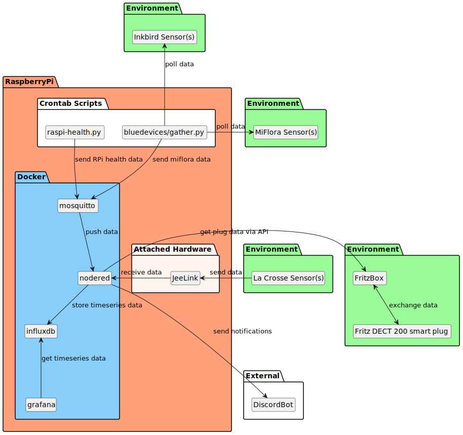

# Smart Home

This is my playground for home automation / smart home, whatever you want to call it.

My goal is to integrate the sensors I have and do something useful. There is no final plan, it evolves as I wade. Please note that the flows are tied to my environment and you might need to adjust them if you reuse them.

## Basic Setup



### Hardware

* [RaspberryPi 2](https://www.raspberrypi.org/products/raspberry-pi-2-model-b/)
* an external 2,5 inch hard disk, I use [Intenso Memory Board](https://www.intenso.de/en/products/hard-drives/memory%20board)
* [Jeelink](https://www.digitalsmarties.net/products/jeelink)
* [La Crosse based temperature sensor: Technoline TX29DTH-IT](https://www.amazon.de/Technoline-Au%C3%9Fensender-Temperatur-Luftfeuchtesender-Display/dp/B00392XX5U/)
* [Fritz!DECT 200 smart plug](https://en.avm.de/products/fritzdect/fritzdect-200/)
* [Xiaomi Mi Plant sensor](https://de.gearbest.com/other-garden-supplies/pp_373947.html)

### Software

* [Nodered](https://nodered.org/)
  * I use a customized fork of [node-red-docker](https://github.com/dArignac/node-red-docker), where the prerequities for using the serial port are made, see [here](https://github.com/node-red/node-red-docker/compare/master...dArignac:master)
  * it is build for `armv7` (Raspberry Pi)
  * it additionally has the `node-red-dashboard` and `node-red-contrib-influxdb` packages preinstalled
  * it is also published to dockerhub: https://hub.docker.com/r/darignac/node-red
* [Mosquitto](https://https://mosquitto.org/)
* [influxdb](https://www.influxdata.com/products/influxdb-overview/)
* [Grafana](https://grafana.com/)

## Open Tasks

See https://github.com/dArignac/smarthome/issues.

## Installation

Follow [SETUP.md](SETUP.md).

Afterwards ramp the services up by running `docker-compose up -d`.

If everything was alright, then you can access the services as follows (Note that my pi is named `nodered`, yours probably has a different name):

* Nodered: http://nodered:1880
  * import the flows from the `nodered` folder - they work out of the box
* Grafana: http://nodered:3000
  * the default credentials are `admin:admin`
  * first, create the datasource for the influxdb at http://nodered:3000/datasources/new
    * URL: `http://influxdb:8086`
    * Database: `db0`
    * User: `user`
    * Password: `password`
    * click `Save & Test`
  * import the dashboards from the `grafana` folder at http://nodered:3000/dashboard/import and choose the influxdb instance

### PiCoolFAN4
If you use PiCoolFAN4 for cooling the Raspberry Pi, check out [PiCoolFAN4/README.md](PiCoolFAN4/README.md).

## Nodered Flows

* [Raspberry Pi Health to Influxdb](./nodered/rpi-nodered.flow.json)
* [La Crosse Temparatur/Humidity to Influxdb via Jeelink](./nodered/jeelink-lacrosse.flow.json)
  * this is tied to my sensors, you need to adjust the flows
* [Xiaomi Mi Plant sensor data to Influxdb](./nodred/miflora.flow.json)

## Grafana Dashboards

* [Raspberry Health](./grafana/rpi.nodered.json)
* [Temperature & Humidity](./grafana/lacrosse.json)

## Additional information

### MQTT Topics

```
# topic for all raspberry pis data
/home/pis/<pi-name>/health
/home/miflora
```

### Influxdb shell

Run `docker-compose exec influxdb influx -precision rfc3339 -database db0`

Then query around, e.g.:

```
SELECT * FROM "raspberries"
SELECT * FROM "lacrosses"
SELECT * FROM "miflora"
SELECT * FROM "miflora" WHERE "sensor" = 'Jasmin'
DELETE FROM "miflora" WHERE "sensor" = 'Wayne'
DROP SERIES FROM "miflora" WHERE "sensor" = 'Jasmin'
```

## Sources used for creating this (loose order)

* https://www.docker.com/blog/happy-pi-day-docker-raspberry-pi/
* https://nodered.org/docs/getting-started/docker
* https://hub.docker.com/_/eclipse-mosquitto
* https://www.raspberrypi.org/documentation/configuration/external-storage.md
* https://github.com/eclipse/mosquitto/issues/1078#issuecomment-489438907
* http://nilhcem.com/iot/home-monitoring-with-mqtt-influxdb-grafana
* https://hub.docker.com/_/influxdb
* https://docs.influxdata.com/influxdb/v1.8/concepts/key_concepts/
* https://grafana.com/docs/grafana/latest/installation/configure-docker/
* https://flows.nodered.org/flow/05a76b25495eb8fd8d3082343f56c645
* https://serialport.io/docs/guide-installation#alpine-linux
* https://github.com/sysstat/sysstat
